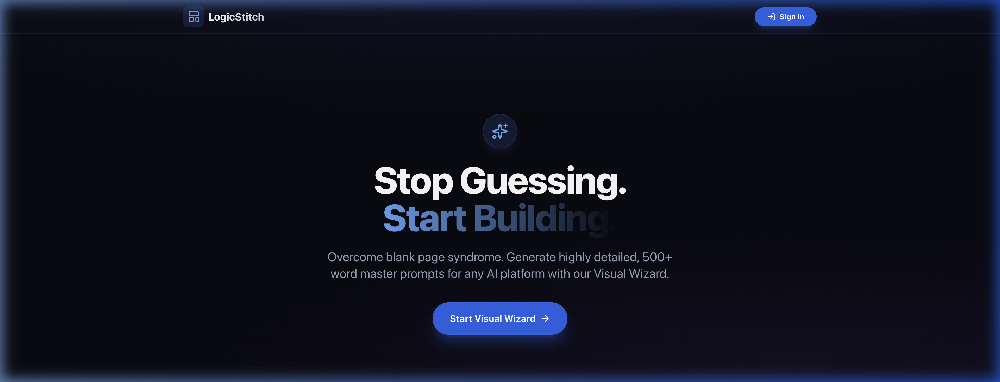

# LogicStitch 🧵

**Overcome blank page syndrome. Stitch together the perfect AI prompt.**

LogicStitch is a premium, visual-first AI prompt builder designed to help users generate highly detailed, 500+ word master prompts for any AI platform (ChatGPT, Claude, Midjourney, etc.). By walking through a guided "Visual Wizard," users can define their project's category, audience, goals, and tone to receive a professionally structured blueprint.



## ✨ Features

- **Visual Wizard Architecture**: A multi-step guided flow that adapts based on your project type.
- **Four Distinct Paths**: Tailored logic for:
  - 🌐 **Websites & Apps**: Component-level design specs and UX principles.
  - ✍️ **Content & Copy**: Platform-specific formatting (LinkedIn, TikTok, Blogs).
  - 📊 **Business Strategy**: Stakeholder-aligned roadmaps and next steps.
  - 🎨 **Creative / Just for Fun**: Imaginative and expressive creative briefs.
- **Smart Recommendations**: UI highlights suggested options based on your previous selections.
- **Premium Dark Theme**: A sleek, high-tech "Midnight Luxury" interface with glassmorphism and ambient glow.
- **User Dashboard**: Save your generated blueprints to your personal library (powered by Supabase).
- **One-Click Export**: Copy to clipboard or download as a Markdown file.

## 🛠️ Tech Stack

- **Frontend**: React 19, TypeScript, Vite
- **Styling**: Tailwind CSS (Custom Dark Theme), Framer Motion (Animations), Lucide React (Icons)
- **Backend / Auth**: Supabase (PostgreSQL + GoTrue)
- **Deployment**: Vite-ready for any static hosting provider.

## 🚀 Getting Started

### Prerequisites

- Node.js (v18 or higher)
- npm or yarn
- A Supabase project (for Authentication and Database)

### Installation

1. **Clone the repository**:
   ```bash
   git clone https://github.com/ishantuteja/LogicStitch.git
   cd LogicStitch
   ```

2. **Install dependencies**:
   ```bash
   npm install
   ```

3. **Configure Environment Variables**:
   Create a `.env.local` file in the root directory and add your Supabase credentials:
   ```env
   VITE_SUPABASE_URL=your_supabase_url
   VITE_SUPABASE_ANON_KEY=your_supabase_anon_key
   ```

4. **Run the development server**:
   ```bash
   npm run dev
   ```

5. **Build for production**:
   ```bash
   npm run build
   ```

## 📂 Project Structure

```text
src/
├── components/       # UI Components (Header, Auth, Dashboard, etc.)
│   └── wizard/       # Wizard-specific components and data
├── lib/              # Core logic (Prompt Generator, Supabase client)
├── types/            # TypeScript interfaces
└── App.tsx           # Main application routing and state
```

## 📄 License

This project is licensed under the MIT License - see the LICENSE file for details.

---

[Ishan Tuteja](https://github.com/ishantuteja)
